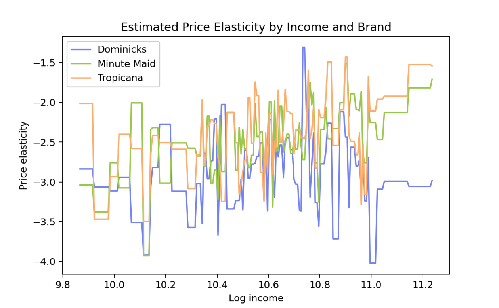

```{python}
#| code-fold: true
#| code-summary: "Packages Used"
#--package load--
import numpy as np
import pandas as pd
import seaborn as sns
import matplotlib.pyplot as plt

from sklearn import model_selection as ms
from sklearn import preprocessing as pp
from sklearn import linear_model
from sklearn import ensemble
from sklearn import metrics

from econml.orf import DMLOrthoForest, DROrthoForest
from econml.dml import CausalForestDML
from econml.sklearn_extensions.linear_model import WeightedLassoCVWrapper, WeightedLasso
from econml.dml import LinearDML
from econml.score import RScorer
```

\newpage

# **Overview**

You have been given a dataset consisting of a single file,
[\[oj_large.csv\]](https://raw.githubusercontent.com/py-why/EconML/refs/heads/data/datasets/OrangeJuice/oj_large.csv).
The dataset is a subset of a dataset compiled during a large study by the
Chicago Booth School of Business, which collaborated with a local supermarket
chain called Dominick\`s Finer Foods, to study the impact of prices,
advertising, and demographics on the sales of a number of products. The dataset
we are working with has over 29, 000 observations of the price of orange juice
and sales for different brands at different Dominick\`s stores. There is a
dataset description here:
[\[](https://github.com/georgehagstrom/DATA622Spring2026/blob/main/website/assignments/labs/labData/oj_dictionary.qmd)[oj_dictionary.qmd\]](https://raw.githubusercontent.com/georgehagstrom/DATA622Spring2026/refs/heads/main/website/assignments/labs/labData/oj_dictionary.qmd)

The goal of this homework assignment is to use Causal Machine Learning to
understand how different demographic factors influence something called the
`price elasticity` of orange juice. You can read more about price elasticity
here: [\[Wikipedia Price Elasticity of
Demand\]](https://en.wikipedia.org/wiki/Price_elasticity_of_demand)

Elasticity of demand is the relationship between a percentage change in sales
and a percentage change in price:

$$
\epsilon= \frac{\partial (\mathrm{SALES})}{\partial (\mathrm{PRICE})}\frac{\mathrm{PRICE}}{\mathrm{SALES}}
$$

This relationship is most natural when expressed in terms of the `log` transform
of both sales and price, as the elasticity becomes the coefficient in a linear
regression model relating the two:

$$
\log(\mathrm{SALES})= \epsilon\log(\mathrm{PRICE}) + \mathrm{error\ terms}
$$

The elasticity $\epsilon$ can be dependent upon a variety of other factors. It
can depend on the price itself (so that we don\`t get a straight line
relationship between the logs), it can depend on the type of product, the
demographics of the shoppers and more.

The `EconML` package developed a vignette where they used Causal ML to show that
$\epsilon$ is a function of income, which is to say that the sales are more
sensitive to price in stores where the median income is lower. You can find that
vignette here and I recommend that you read it and use some code from it as a
starting point (it covers more than OJ but it is there): [\[EconML OJ
Vignette\]](https://github.com/py-why/EconML/blob/main/notebooks/Causal%20Forest%20and%20Orthogonal%20Random%20Forest%20Examples.ipynb).
To read more about the package and its applications, see [\[pywhy
EconML\]](https://www.pywhy.org/EconML/spec/spec.html).The [\[tutorial for this
package\]](https://www.pywhy.org/dowhy/v0.8/example_notebooks/tutorial-causalinference-machinelearning-using-dowhy-econml.html)
is helpful as well.

```{python}
oj= pd.read_csv("https://raw.githubusercontent.com/py-why/EconML/refs/heads/data/datasets/OrangeJuice/oj_large.csv")

oj.columns= oj.columns.str.lower()
```

### Data Dictionary:

::: {#data-dictionary}
`store`: The store number of the observation

`brand`: The brand of orange juice corresponding to this observation. Values are
`tropicana, minute.maid`, and `dominicks` (one hot)

`week`: The week of the study that the data was collected (one hot)

`logmove`: The `log` of the the number of units sold during that week

`feat`: Binary indicator variable of whether or not there was an advertisement
for orange juice

`price`: The price per unit during that week at that store

`AGE60`: Fraction of the population over age 60 in the region of the store

`EDUC`: The percentage of the population with a college degree

`ETHNIC`: The percentage of the population that is Black or Hispanic

`INCOME`: The `log` of the median income of the population

`HHLARGE`: The fraction of households with 5 or more people

`WORKWOM`: The percentage of women in the area with full time jobs

`HVAL150`: The percentage of households with more than \$150, 000 of net worth

`SSTRDIST`: The average distance in miles to the nearest warehouse store

`SSTRVOL`: The ratio of sales of this store to the nearest warehouse store

`CPDISTS`: The average distance in miles to the nearest 5 supermarkets

`CPWVOL5`: The ratio of sales of this store to the average of the nearest 5
stores
:::

--------------------------------------------------------------------------------

## Problem 1: Testing on Fake Data

### (a)

It is standard practice in Causal Inference to test models on simulated response
data based on the original covariates of the dataset before fitting to the
original dataset. Use the same selection of confounders as in the original
vignette (The `W` matrix), excluding `week`, `store`, `price`, `INCOME`, and
`logmove`, applying One-Hot encoding/dummies to the `brand` variables to
incorporate them into `W`. Apply the `StandardScaler` to `W`. Then put the
variable `INCOME` into a matrix called "X" and standardize it. The matrix `X`
contains \_modifier\_ variables whose effect on the elasticity will be studied.

Then you will simulate a relationship between your confounders and the price,
you can use code like this: `T_sim= 0.8 + W[:, support] @ coefs_T + noise`,
where `support` is sparse (most entries are 0, the rest are 1) and `coefs_T` is
random (the 0.8 is just for scale).

Look to the simulation code earlier in the `EconML` vignette for inspiration.

The original vignette uses the code below to create the fake data:

```{python}
#| echo: true
#| eval: false

# DGP constants
np.random.seed(123)
n= 1000
n_w= 30
support_size= 5
n_x= 1

# Outcome support
support_Y= np.random.choice(range(n_w), size=support_size, replace=False)
coefs_Y= np.random.uniform(0, 1, size=support_size)
def epsilon_sample(n):
    return np.random.uniform(-1, 1, size=n)

# Treatment support
support_T= support_Y
coefs_T= np.random.uniform(0, 1, size=support_size)
def eta_sample(n):
    return np.random.uniform(-1, 1, size=n)

# Generate controls, covariates, treatments and outcomes
W= np.random.normal(0, 1, size=(n, n_w))
X= np.random.uniform(0, 1, size=(n, n_x))

# Heterogeneous treatment effects
TE= np.array([exp_te(x_i) for x_i in X])
T= np.dot(W[:, support_T], coefs_T) + eta_sample(n)
Y= TE * T + np.dot(W[:, support_Y], coefs_Y) + epsilon_sample(n)

# ORF parameters and test data
subsample_ratio= 0.3
lambda_reg= np.sqrt(np.log(n_w) / (10 * subsample_ratio * n))
X_test= np.array(list(product(np.arange(0, 1, 0.01), repeat=n_x)))
```

We'll modify the code to fit this problem. First, we set a seed to help the
synthetic data reproduciblity:

```{python}
np.random.seed(646)
```

Next, we'll write a line for our exclusions and one-hot the brand column.

```{python}
exclusions= ["week", "store", "price", "income", "logmove"]
oj= pd.get_dummies(oj, columns= ["brand"], drop_first= True, dtype=int)
#-- unscaled confounders (for W matrix)-- 
prep_w= oj.drop(columns= exclusions)
```

About the confounders, Problem 1a asks to "use the same selection of confounders
as the original". The vignette selects 30 variables (`n_w= 30`) for the `W`
matrix. Our original data has 17 columns, 18 after the one-hot. After our
exclusions, we're down to 13.

```{python}
#-- scaling--
W_scaler= pp.StandardScaler()
W= W_scaler.fit_transform(prep_w)

#-- confounder matrix--
W
```

Next we'll place the income variable in `X` matrix and run the transformations
as well.

```{python}
#-- unscaled effect (for X matrix)--
prep_x= oj[["income"]]

#-- scaling--
X_scaler= pp.StandardScaler()
X= X_scaler.fit_transform(prep_x)

#-- effect matrix-- 
X
```

The "support" are the count of random variables (arrays) selected to affect the
treatment and outcome. The vignette selects 5 random variables as support, out
of 30. We'll simulate the same proportion as support for this data since we only
have 13.

```{python}
support_size= round(W.shape[1]*(5/30))
support_size= max(support_size, 1)

#-- confounders-- 
n_conf= W.shape[1]
```

Then we'll use the same parameters as the original for randomized selection. We
wont need a `support_Y` , we select 2 variables randomly. For `coefs_Y` we
select random coefficient values for the strength of the randomly selected
variables. I created separate noise variables for the sim treatment and sim
outcome, following the structure of the vignette (and because identical noise
might be counterproductive here).

```{python}
#-- which confounders affect on sim treatment and outcome--
support= np.random.choice(range(n_conf), size=support_size, replace= False)

#--strength of confounder affect of treatment--
coefs_T= np.random.uniform(0, 1, size= support_size)

#--strength of confounder effect of outcome--
coefs_Y= np.random.uniform(0, 1, size= support_size)

#-- random sim prices--
noise_T= np.random.uniform(-1, 1, size=W.shape[0])
#-- random sim sales--
noise_Y= np.random.uniform(-1, 1, size=W.shape[0])
```

Then we'll simulate the relationship between the confounders and the treatment
using the formula given which is essentially:

$$
sim\ treatment= (intercept )+ (confounder\ effect) + (treatment\ noise) 
$$

```{python}
#-- Treatmnet--
#-- (T_sim= (0.8) + (W[:, support] @ coefs_T) + (noise_T)--
t_intercept= 0.8
t_confounder= W[:, support] @ coefs_T
t_noise= noise_T
T_sim= t_intercept+ t_confounder+ t_noise
```

--------------------------------------------------------------------------------

### (b)

Now, simulate the values of the `logmove` (in a matrix called `Y_sim`) using
your `T_sim`, your confounders `W`, and your modifier `X`. Make the relationship
between `Y_sim`, `T_sim`, and `X` nonlinear using something like this:
`Y_sim= (-2.5 \ np.tanh(2.0\X))\T_sim + W[:, support] @ coefs_Y + noise`, where
`coefs_Y` is random (we are using the same `support` in both simulations).

We'll add `.ravel()` to flatten our modifier in the formula for our simulated
putcome (sales) which can be translated to:

$$
sim sales= (true\ elasticity )* (sim\ treatment) + (confounder\ effect) + (outcome\ noise) 
$$

```{python}
#-- Outcome-- 
#--Y_sim= (-2.5 \ np.tanh(2.0\X))\T_sim + W[:, support] @ coefs_Y + noise--
true_cate_obs= (-2.5 * np.tanh(2.0* X).ravel())

t_effect= true_cate_obs * T_sim
confounder_effect= W[:, support] @ coefs_Y
o_noise= noise_Y
Y_sim= t_effect + confounder_effect + o_noise
```

### (c)

Using the code from the vignette, fit a Causal Forest (`CausalForestDML`) and a
linear model (`LinearDML`) to the simulated data. For both models, plot the
predicted elasticity as a function of the `INCOME`, showing the confidence
intervals and the real relationship. Also plot the predicted elasticity and the
true elasticity for each simulated observation.

Report the true and estimated ATE with confidence intervals. Comment on the
performance of both models on the simulated data.

```{python}
cf= CausalForestDML(
  model_y= ensemble.RandomForestRegressor(n_estimators= 100, min_samples_leaf= 10, random_state= 646), 
  model_t= ensemble.RandomForestRegressor(n_estimators= 100, min_samples_leaf= 10, random_state= 646), 
  n_estimators= 500, min_samples_leaf= 10, random_state= 646)
#-- fit--
cf.fit(Y= Y_sim, T= T_sim, X= X, W= W)
```

```{python}
linear= LinearDML(
  model_y= ensemble.RandomForestRegressor(n_estimators= 100, min_samples_leaf= 50, random_state= 646), 
  model_t= ensemble.RandomForestRegressor(n_estimators= 100, min_samples_leaf= 50, random_state= 646), 
  random_state= 646)
#-- fit--
linear.fit(Y= Y_sim, T= T_sim, X= X, W= W)
```

Now that the models are fit, we'll create a grid of incomes to see the effect
predictions of the models and then plot

```{python}
x_grid= np.linspace(X.min(), X.max(), 100).reshape(-1, 1)

#-- conditional avg treatment effect CATE--
cf_cate_grid= cf.effect(x_grid)

#-- confidence intervals--  
cf_lower_grid, cf_upper_grid= cf.effect_interval(x_grid)
```

```{python}
#| title: "Causal Forest Plot: Estimates vs True"
true_cate_grid= (-2.5* np.tanh(2.0 * x_grid)).ravel()

plt.figure(figsize= (10, 5))
plt.plot(x_grid.ravel(), cf_cate_grid, label= "CausalForestDML Prediction")

#-- adding confidence intervals--
plt.fill_between(x_grid.ravel(), cf_lower_grid, cf_upper_grid, label= "95% CI", alpha= 0.3)

plt.plot(x_grid.ravel(), true_cate_grid, 'r--', label="true elasticity")
plt.plot(X.ravel(), np.zeros_like(X.ravel()), '|', color='gray', alpha=0.1, markersize=5)
plt.xlabel('Standardized Income (sd +/- avg log income)')
plt.ylabel('Elasticity')
plt.legend()
plt.title("CausalForestDML: Estimates vs True")
plt.show()
```

The model estimation (in blue) follows the true elasticity (in red), so this
suggests the Causal Forest model simulated the relationship between price and
sales well. The trajectory of the line simulated shows this relationship is not
a linear one. The confidence interval overlayed on the estimates is also very
close, so we can say the model is pretty confident about its predictions,
particularly in the center.

Now for the LinearDML:

```{python}
#| title: "Linear Plot: Estimates vs True"

x_grid= np.linspace(X.min(), X.max(), 100).reshape(-1, 1)

#-- conditional avg treatment effect CATE--
lin_cate_grid= linear.effect(x_grid)

#-- confidence intervals--  
lin_lower_grid, lin_upper_grid= linear.effect_interval(x_grid)

#-- true cate-- 
true_cate_grid= (-2.5 * np.tanh(2.0 * x_grid)).ravel()

#-- plotting--
plt.figure(figsize=(10, 5))
plt.plot(x_grid.ravel(), lin_cate_grid, label="LinearDML Prediction")
plt.fill_between(x_grid.ravel(), lin_lower_grid, lin_upper_grid, label="95% CI", alpha=0.3)

plt.plot(x_grid.ravel(), true_cate_grid, "r--", label="True elasticity")

plt.plot(X.ravel(), np.zeros_like(X.ravel()), "|", color="gray", alpha=0.1, markersize=5)

plt.xlabel("Standardized income")
plt.ylabel("Elasticity")
plt.legend()
plt.title("LinearDML: Estimates vs True")
plt.show()
```

The performance of the LinearDML is not ideal. The estimates are linear but the
true elasticity was simulated to be non-linear. This model would not be the best
choice here.

Next, we'll look at the observations:

```{python}
#| title: "CausalForestDML & LinearDML: Observations"
#| layout-ncol: 2

#-- CF--
cf_obs= cf.effect(X)
plt.figure(figsize=(6, 6))

plt.scatter(true_cate_obs, cf_obs,c= "#FD6947", s= 0.8, alpha=0.3)
plt.axline((0, 0), slope=1, alpha= 0.2)

plt.xlabel("True elasticity")
plt.ylabel("Predicted elasticity")
plt.title("CausalForestDML: True vs Predicted Elasticity")
plt.show()

#-- Linear--
linear_obs= linear.effect(X)
plt.figure(figsize=(6, 6))

plt.scatter(true_cate_obs, linear_obs,c= "#8698F3", s= 0.8, alpha=0.3)
plt.axline((0, 0), slope=1, alpha= 0.2)

plt.xlabel("True elasticity")
plt.ylabel("Predicted elasticity")
plt.title("LinearDML: True vs Predicted Elasticity")
plt.show()

```

The observations plots compare a diagnal line (as the ideal predictions) to the
predicted elasticity. The CausalDML observations (orange dots) follow the line
closely. On the other hand the LinearDML has overall more points with a large
distance from the line.

#### Average Treatment Effect (ATE)

```{python}
true_ate= true_cate_obs.mean()

cf_ate= cf.ate(X=X)
cf_ate_lower, cf_ate_upper= cf.ate_interval(X=X)

linear_ate= linear.ate(X=X)
linear_ate_lower, linear_ate_upper= linear.ate_interval(X=X)
```

```{python}
#| echo: false
#| eval: true


print(f"True ATE: {true_ate:.3f}")
print(f"\n")
print(f"Causal Forest estimated ATE: {cf_ate:.3f}")
print(f"Causal Forest ATE CI: ({cf_ate_lower:.3f}, {cf_ate_upper:.3f})")
print(f"\n")
print(f"LinearDML estimated ATE: {linear_ate:.3f}")
print(f"LinearDML ATE CI: ({linear_ate_lower:.3f}, {linear_ate_upper:.3f})")
```

The average treatement effect is negative (-0.162). The models both have an
estimated ATE that are close to the true ATE. Neither of the model confidence
interval include zero, but both intervals include the ATE value. This suggests
both models do a decent job at estimating the average treatment effect. However,
the CausalForestDML is better because the data was simulated as nonlinear.

## Problem 2: Checking for Overlap

In order for Causal ML to be successful, there needs to be variation in the
treatment variable for all combinations of the confounder variables. For a
continuous treatment, it is important that there is residual variation left-over
after the Causal Forest predicts the treatment using confounders. Keeping with
the structure of the original vignette (same definition of `W`, `X`, `Y`, and
`T`), **use `LassoCV`** to predict $T$ using $W$. Calculate and report the
$R^2$. Does this value of $R^2$ support the suitability of this dataset for
Causal Inference?

```{python}
#-- real-- 
T= np.log(oj["price"])
Y= oj["logmove"]

#-- Lasso--
lasso_t= linear_model.LassoCV(cv=5, random_state=646, max_iter=10000)
lasso_t.fit(W, T)
T_p= lasso_t.predict(W)
rsq_t= metrics.r2_score(T, T_p)

print(f"Treatment prediction R-squared: {rsq_t:.3f}")
print(f"\n")
print(f"The model explains {rsq_t* 100:.1f}% of the variation in log price")
```

The R^2^ is less than 1.0. The model explains a little more than half of the
variation in log price which leaves room for leftover residual variation. This
leftover variation is what's necessary for the causal model needs. Otherwise, if
the price was caused by the confounders entirely, then there would be nothing
more for the model to learn.

## Problem 3: Fitting and Interpreting the Model

### (a)

Perform a train-test split on the data. Repeat the fit in the vignette to the
training set (you can copy their code with suitable modifications to make it
work) using a `CausalForestDML` model to learn the effect of `income` on `price`
elasticity. Plot the price elasticity versus income with confidence intervals.
Calculate the average treatment effect and confidence intervals.

```{python}
#-- real treatment and outcome-- 
T= np.log(oj["price"]).values
Y= oj["logmove"].values

Y_train, Y_test, T_train, T_test, X_train_raw, X_test_raw, W_train_raw, W_test_raw= ms.train_test_split(Y, T, prep_x, prep_w, test_size=0.2, random_state=646)

#-- scaling-- 
W_scaler= pp.StandardScaler()
W_train= W_scaler.fit_transform(W_train_raw)
W_test= W_scaler.transform(W_test_raw)

X_scaler= pp.StandardScaler()
X_train= X_scaler.fit_transform(X_train_raw)
X_test= X_scaler.transform(X_test_raw)

#-- fit-- 
cf_real= CausalForestDML(
  model_y=WeightedLassoCVWrapper(), model_t=WeightedLassoCVWrapper(), n_estimators=500, min_samples_leaf=10, max_depth=50, random_state=646)

cf_real.fit(Y= Y_train, T= T_train, X= X_train, W= W_train)
```

We'll create a plot:

```{python}
#-- income grid in original income units--
income_grid_raw= pd.DataFrame(np.linspace(X_train_raw["income"].min(), X_train_raw["income"].max(), 100), columns=["income"])

#-- scale income grid--
income_grid= X_scaler.transform(income_grid_raw)

#-- predicted elasticity--
e_grid= cf_real.effect(income_grid)
e_lower, e_upper= cf_real.effect_interval(income_grid)

#-- plot--
plt.figure(figsize=(10,  6))
plt.plot(income_grid_raw["income"], e_grid, label="Estimated price elasticity")
plt.fill_between(income_grid_raw["income"], e_lower, e_upper, alpha=0.3, label="95% CI")
plt.plot(X_train_raw["income"], np.repeat(e_lower.min(), len(X_train_raw)), "|", color="gray", alpha=0.1, markersize=2)
plt.xlabel("Log income")
plt.ylabel("Price elasticity")
plt.title("CausalForestDML: Price Elasticity vs Income")
plt.legend()
plt.show()
```

#### ATE

```{python}
ate_real= cf_real.ate(X=X_test)
ate_lower_real, ate_upper_real= cf_real.ate_interval(X=X_test)

print(f"Estimated ATE: {ate_real:.3f}")
print(f"ATE 95% CI: ({ate_lower_real:.2f}, {ate_upper_real:.2f})")
```

The results suggest that an increase in price causes a \~2.6% decrease in juice
sold.

### (b)

Compute the R-score on the testing/validation set to determine the strength of
the heterogeneity. What is your interpretation of the R-score value?

Fit a `LinearDML` model in the same manner and compare the R-score to the
`CausalForestDML`. Is either model noticeably better?

```{python}
#--fit--
linear_real= LinearDML(model_y=WeightedLassoCVWrapper(), 
model_t=WeightedLassoCVWrapper(),random_state=646)

linear_real.fit(Y=Y_train, T=T_train, X=X_train, W=W_train)

#-- EconML Rscore--
rscorer= RScorer(model_y=WeightedLassoCVWrapper(), model_t=WeightedLassoCVWrapper(), random_state=646)

#-- rscore fit--
rscorer.fit(Y_test, T_test, X=X_test, W=W_test)

#-- r-score--
cf_rscore= rscorer.score(cf_real)
linear_rscore= rscorer.score(linear_real)

print(f"CausalForestDML R-score: {cf_rscore:.4f}")
print(f"LinearDML R-score: {linear_rscore:.4f}")
```

The CausalForestDML has a slightly higher score, so it is slightly better than
the LinearDML. Both are close to zero, which means the effect may be different
between groups, or heteregenous.

### (c)

Compute a sensitivity check using the `sensitivity_interval` method of your fit
model. This determines how strong an \_unobserved confounder\_ would have to be
to change the results of your analysis in a meaningful way. The method
recalculates confidence intervals for the \_ATE\_ based on two parameters `c_t`
and `c_y`, which are the fraction of residual variance explained by the
hypothetical confounder for the treatment and the target respectively.

One method for determining the range of `c_t` and `c_y` to explore by checking
the values of `c_t` and `c_y` for existing confounders. If you were to do this
check, you would find that the most important confounder is the `feat` variable
(whether the item was advertised that week), and the range should be up to
`c_t=0.1` and `c_y=0.3`.

Compute the sensitivity check for the most **extreme scenario**, with `c_t=0.1`
and `c_y=0.3`. What are the resulting confidence intervals for the ATE? Do they
contain 0?

```{python}
sens_lower, sens_upper= cf_real.sensitivity_interval(c_t=0.1, c_y=0.3, alpha=0.05)

print(f"Extreme Sensitivity interval: ({sens_lower:.2f}, {sens_upper:.2f})")
```

The sensitivity interval does not include zero. So, this suggests that even in
an "extreme senario" the average treatment estimate is negative. The models
support the idea that price increases cause a decline in sales.

## Problem 4: CATE for Brands and Income

The three brands of orange juice have different price points and are targeted at
different customer segments, with `dominicks` as the discount brand,
`minute.maid` as the mid-range brand, and `tropicana` as the premium brand. Move
the brand variables from confounder matrix W to the modifier matrix X and refit
the model.

Calculate the feature importance for all the modifiers and plot the elasticity
as a function of income for each of the three brands. How do the elasticities
differ by brand?

The brand column was one hot encoded at the start of the report, we'll extract
those.

```{python}
brand_cols= [col for col in oj.columns if col.startswith("brand_")]
brand_cols
```

There are only two brand columns but there are three brands. This is because I
used `drop_first= True` at the start of the report when I one-hot encoded. One
of the juice brands is coded as 0, 0; Dominick's.

```{python}
#-- treatment and outcome--
T= np.log(oj["price"]).values
Y= oj["logmove"].values

prep_x_brand= oj[["income"]+ brand_cols]
prep_w_brand= prep_w.drop(columns=brand_cols)

#-- split and scale-- 
Y_train_b, Y_test_b, T_train_b, T_test_b, X_train_raw_b, X_test_raw_b, W_train_raw_b, W_test_raw_b= ms.train_test_split(Y,  T,  prep_x_brand,  prep_w_brand,  test_size=0.2,  random_state=646)

W_scaler_b= pp.StandardScaler()
W_train_b= W_scaler_b.fit_transform(W_train_raw_b)
W_test_b= W_scaler_b.transform(W_test_raw_b)

X_scaler_b= pp.StandardScaler()
X_train_b= X_scaler_b.fit_transform(X_train_raw_b)
X_test_b= X_scaler_b.transform(X_test_raw_b)

#--fit--
cf_brand= CausalForestDML(model_y=WeightedLassoCVWrapper(), model_t=WeightedLassoCVWrapper(), n_estimators=500, min_samples_leaf=10, max_depth=50,random_state=646)

cf_brand.fit(Y=Y_train_b, T=T_train_b, X=X_train_b, W=W_train_b)
```

```{python}
#-- feature importance--
importance_df= pd.DataFrame({"modifier": prep_x_brand.columns, 
"importance": cf_brand.feature_importances_}).sort_values("importance", ascending=False)
importance_df

#-- plot--
plt.figure(figsize=(10, 6))
plt.barh(importance_df["modifier"], importance_df["importance"], color= "#A7CE5B")
plt.xlabel("Feature importance")
plt.ylabel("Modifiers")
plt.title("Modifier Importances for Price Elasticity")
plt.gca().invert_yaxis()
plt.show()

```

The modifier plot shows income is the most important driver of price elasticity.

```{python}
#-- elasticity for brands--
#-- income grid--
#--(changing to 30 for more smoothness and clarity in the plot-- )
income_values= np.linspace(X_train_raw_b["income"].min(), X_train_raw_b["income"].max(), 30)

#-- defining the brand encoding--
dominicks_grid= pd.DataFrame({"income": income_values, "brand_minute.maid": 0, "brand_tropicana": 0})

minute_maid_grid= pd.DataFrame({"income": income_values, "brand_minute.maid": 1, "brand_tropicana": 0})

tropicana_grid= pd.DataFrame({"income": income_values, "brand_minute.maid": 0, "brand_tropicana": 1})
```

```{python}
#| error: false
#| warning: false
#-- scale--
dominicks_grid_scaled= X_scaler_b.transform(dominicks_grid)
minute_maid_grid_scaled= X_scaler_b.transform(minute_maid_grid)
tropicana_grid_scaled= X_scaler_b.transform(tropicana_grid)

dominicks_effect= cf_brand.effect(dominicks_grid_scaled)
minute_maid_effect= cf_brand.effect(minute_maid_grid_scaled)
tropicana_effect= cf_brand.effect(tropicana_grid_scaled)

#-- plot--
plt.figure(figsize=(10, 6))

plt.plot(income_values, dominicks_effect, label="Dominicks- Budget", c= "#8698F3")
plt.plot(income_values, minute_maid_effect, label="Minute Maid- Mid", c= "#A7CE5B")
plt.plot(income_values, tropicana_effect, label="Tropicana- Premium", c= "#FFBA7E")

plt.xlabel("Log income")
plt.ylabel("Price elasticity")
plt.title("Estimated Price Elasticity by Income and Brand")
plt.legend()
plt.show()
```

{fig-align="center"
width="334"}

(To make the plot more readable, I modified the income grid to 30 in order to
help smooth plotted lines. Because this is a forest model, the additional grid
points add more steps into the visualization. A less granular model smoothes the
plot and makes it a little easier to examine.)

The further from zero the price elasticity the more sensitive to changes in
price. The plot shows all three brands have negative elasticity, so regardless
of brand, the model estimates there is increased sensitivity to price changes.

Dominick's brand seems to dip the lowest and is more sensitive to these changes.
Tropicana and Minute Maid have an overall trend of decreased elasticity the
higher the log median income of the population. Dominick's is (was) a private
label of a grocery store and an otherwise less expensive option. We learned
earlier from the Modifier Plot, that income is an important driver of price
elasticity and this plot supports that. Dominick's being a budget store brand,
Tropicana being premium label, it makes intuitive sense that the higher income
buyers stick with their premium brand of choice.

--------------------------------------------------------------------------------

## References

-   Relevant Class Modules:\
    <https://georgehagstrom.github.io/DATA622Spring2026/modules/module10.html>
-   [Interpretable Machine Learning 2-4,
    17-18](https://christophm.github.io/interpretable-ml-book/interpretability.html)
-   [Fairness and Machine Learning- 1](https://fairmlbook.org/index.html)
-   CausalML Vignettes 1-3:
    -   1\) Simulating Data:\
        <https://youtu.be/UVcJWcCVq9g?si=7zLy2QUYuchql0yI>

    -   2\) Recovering Simulated Treatment Effect:\
        <https://youtu.be/GV2q_saIbsk?si=ufKcDpw09Jsz05Dy>

    -   3\) Quality Checks and Fit to Data: \
        <https://youtu.be/ZxszowvvEoY>
